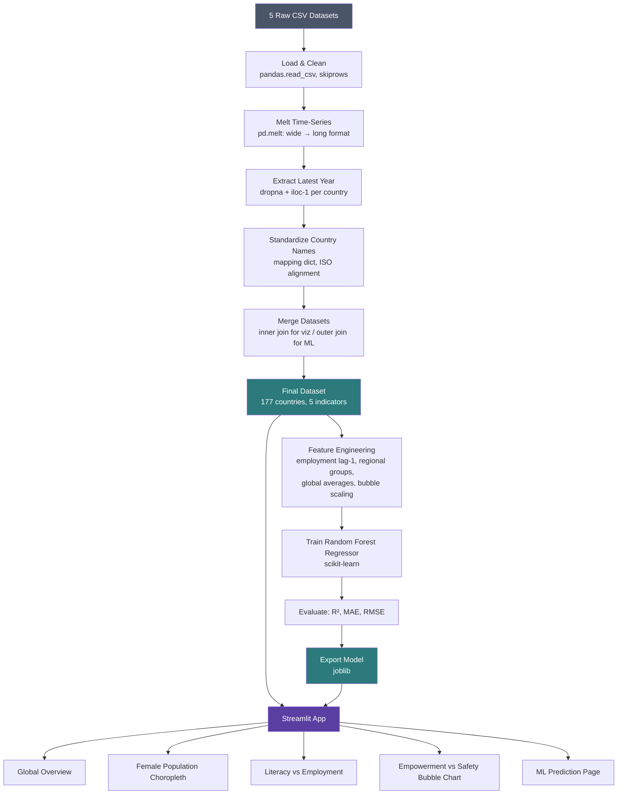

# 🌍 Global Women Empowerment Data Dashboard

An interactive **Streamlit** dashboard that unifies five global datasets — literacy, employment, female population, the UN Women Empowerment Index (WEI), and the GIWPS/PRIO Women, Peace & Security Index — into a single platform for exploring women's empowerment across **177 countries**. The dashboard also includes a **Random Forest Regression** model that predicts each country's next-year female employment rate.

Built during a 6-week Python & Machine Learning internship at **Anveshan Foundation, IGDTUW** (Sept–Oct 2025).

---

## ✨ Features

- **Global Overview** — KPI cards showing world averages for literacy, employment, empowerment, and safety
- **Female Population Map** — interactive choropleth (Plotly) showing female population % by country
- **Literacy vs Employment** — dual-axis trend lines, with India benchmarked against South Asia, BRICS, Nordic countries, and the global average
- **Empowerment vs Safety** — bubble chart (WEI vs. Safety Index, sized by employment rate, colored by region)
- **ML Prediction Module** — select any country and view its predicted next-year female employment rate, powered by a trained Random Forest Regression model

---

## 🏗️ Architecture



---

## 🧠 Machine Learning

| | |
|---|---|
| **Task** | Regression — predict next-year female employment rate |
| **Model** | Random Forest Regression (scikit-learn) |
| **Features** | Employment (lag-1), Literacy, Female Population %, WEI (2022), Safety Index (2024) |
| **Evaluation** | R² Score, MAE, RMSE |
| **Deployment** | Trained model exported with `joblib`, loaded directly inside the Streamlit app for real-time inference |

---

## 🛠️ Tech Stack

| Category | Tools |
|---|---|
| Language | Python 3.10 |
| Data Processing | pandas, numpy |
| Visualization | matplotlib, plotly.express |
| Web App | Streamlit, streamlit-option-menu |
| Machine Learning | scikit-learn, joblib |
| Dev Environment | VS Code, Jupyter Notebook (for testing) |

---

## 📊 Data Sources

- [World Bank Gender Data Portal](https://genderdata.worldbank.org/) — literacy, employment, population
- [UN Women Data Hub](https://data.unwomen.org/) — Women's Empowerment Index (WEI 2022)
- [GIWPS / PRIO Women, Peace & Security Index](https://giwps.georgetown.edu/the-index/) — safety index (2024)
- [Kaggle — Women Empowerment Indicators](https://www.kaggle.com/) — supplementary cross-validation data

---

## 🚀 Running Locally

```bash
git clone https://github.com/Siddiqua2007/Global-Women-Empowerment-Data-Dashboard.git
cd Global-Women-Empowerment-Data-Dashboard
pip install -r requirements.txt
streamlit run app.py
```

---

## 🔭 Future Work

- Expand indicator coverage (political participation, healthcare access, digital inclusion, wage gap)
- Multi-year forecasting (LSTM / XGBoost) instead of single-year prediction
- Live API integration with World Bank / UN Women instead of static CSVs
- Country-specific drill-down pages
- Clustering / PCA to group countries by empowerment pattern

---

## 👩‍💻 Author

**Siddiqua Abedeen** — B.Tech, Information Technology, IGDTUW
Internship Mentor: Dr. Ritu Rani (Anveshan Foundation, IGDTUW)
