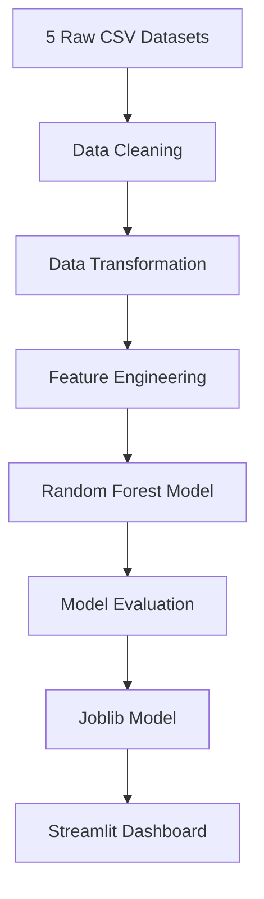

# 🌍 Global Women Empowerment Data Dashboard


An interactive **Machine Learning powered Streamlit dashboard** that combines **five global datasets** related to women's literacy, employment, empowerment, population share and safety across **177 countries**.

The application provides visual analytics, regional comparisons and predicts **next-year female employment rates** using a trained **Random Forest Regression** model.

Developed during a **6-week Python & Machine Learning Internship** at **Anveshan Foundation, IGDTUW**.

---

# 📌 Table of Contents

- Project Overview
- Features
- Demo
- Screenshots
- Tech Stack
- Dataset
- Machine Learning Model
- System Architecture
- Project Structure
- Installation
- Usage
- Results
- Future Improvements
- Author
- License

---

# 📖 Project Overview

The objective of this project is to analyze global indicators related to women's empowerment and transform them into meaningful insights through interactive visualizations and predictive analytics.

The dashboard integrates multiple international datasets into one unified platform and enables users to:

- Analyze female literacy trends
- Compare employment across regions
- Explore Women's Empowerment Index
- Visualize female population distribution
- Study safety indicators
- Predict next year's female employment rate using Machine Learning

---

# ✨ Features

## 📊 Dashboard

- Global KPI Cards
- World Choropleth Map
- Literacy Trend Analysis
- Employment Trend Analysis
- Regional Comparison
- Bubble Chart
- Country-wise Analytics

---

## 🤖 Machine Learning

- Random Forest Regression
- Next-Year Female Employment Prediction
- Real-time Prediction
- Saved Model using Joblib
- Performance Evaluation using R², MAE and RMSE

---

# 🛠 Tech Stack

| Category | Technologies |
|-----------|--------------|
| Language | Python 3.10 |
| Framework | Streamlit |
| Data Processing | Pandas, NumPy |
| Visualization | Plotly Express, Matplotlib |
| Machine Learning | Scikit-Learn |
| Model Deployment | Joblib |
| Development | VS Code, Jupyter Notebook |

---

# 🌍 Dataset

The dashboard integrates data from five trusted international sources.

| Dataset | Source |
|----------|--------|
| Female Literacy | World Bank |
| Female Employment | World Bank |
| Female Population | World Bank |
| Women's Empowerment Index | UN Women |
| Women Peace & Security Index | GIWPS |

Coverage

- 177 Countries
- 2015–2024

---

# 🤖 Machine Learning Model

## Objective

Predict next year's female employment rate.

### Model

Random Forest Regressor

### Features

- Previous Year Employment (Lag-1)
- Female Literacy Rate
- Female Population %
- Women's Empowerment Index
- Women Safety Index

### Target

Female Employment Rate (Next Year)

---

## Model Evaluation

Metrics used

- R² Score
- Mean Absolute Error (MAE)
- Root Mean Square Error (RMSE)

The trained model is exported using **Joblib** and loaded directly inside Streamlit for real-time prediction.

---

# ⚙️ System Architecture



---

# 📁 Project Structure

```
Global-Women-Empowerment-Data-Dashboard
│
├── data/
│
├── model/
│   └── random_forest_model.pkl
│
├── notebooks/
│
├── app.py
├── requirements.txt
├── README.md
│
└── assets/
```

---

# 🚀 Installation

Clone the repository

```bash
git clone https://github.com/Siddiqua2007/Global-Women-Empowerment-Data-Dashboard.git
```

Move into project directory

```bash
cd Global-Women-Empowerment-Data-Dashboard
```

Install dependencies

```bash
pip install -r requirements.txt
```

Run Streamlit

```bash
streamlit run app.py
```

---

# 📈 Key Results

- Integrated 5 global datasets
- Standardized country names across sources
- Created unified dataset covering 177 countries
- Built interactive visual analytics dashboard
- Developed Machine Learning prediction module
- Enabled real-time inference using Streamlit

---

# 🔍 Key Findings

- India's female literacy improved from approximately **64% (2015)** to **74% (2023)**.
- Female employment remains comparatively low (**28–32%**) despite improvements in education.
- Russia has one of the highest female population shares (**53.54%**) among major economies.
- Women's safety shows a positive relationship with empowerment levels.
- Random Forest successfully predicts country-wise next-year female employment.

---

# 🚀 Future Improvements

- LSTM-based multi-year forecasting
- XGBoost implementation
- Live API integration
- Automatic dataset updates
- State-wise India dashboard
- Advanced clustering analysis
- Explainable AI using SHAP


```
MIT License
```
